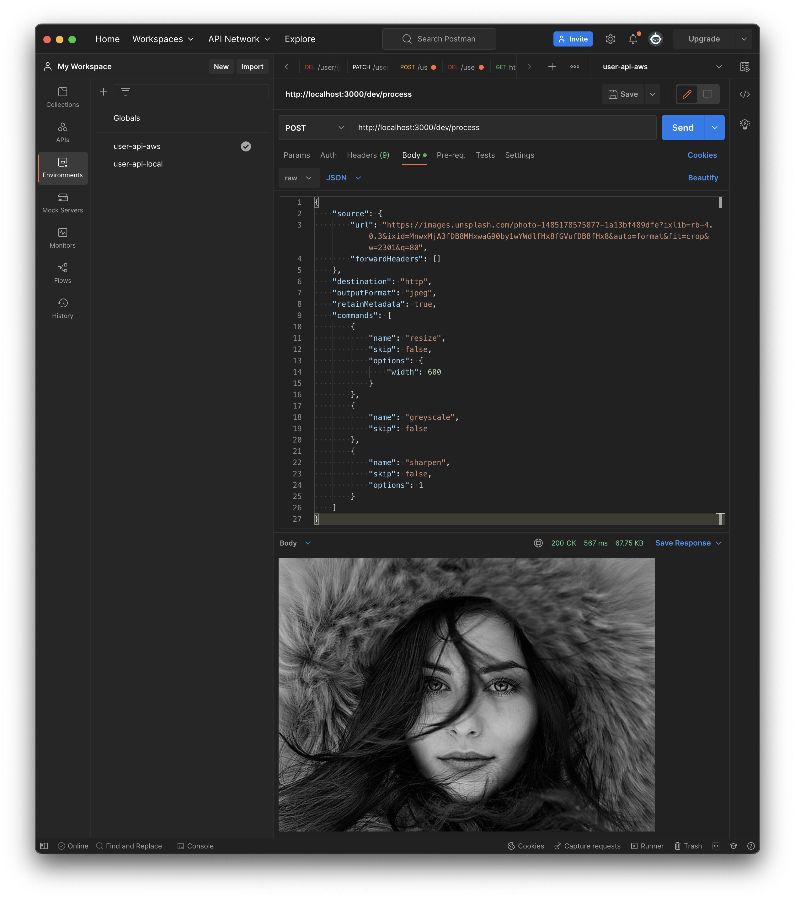

# Serverless image transformation

Agnostic Serverless function for transforming images on the fly using [npm sharp](https://www.npmjs.com/package/sharp).

Features:

- HTTP interface
- Event driven interface

## Available flows

### S3 pre-signed URL flow

1. User requests pre-signed S3 upload URL
2. User uploads image and receives the absolute S3 URL in the response
3. User

###

# Step from UI

### 1 Authenticated user requests pre-signed S3 upload URL

Show curl

### 2 User posts image transformation instructions includi

Show curl

Using JSON you can instruct the image processor to perform any number of transformations in a series.
Using the HTTP



## Sample payload

```json
{
  "source": {
    "url": "https://upload.wikimedia.org/wikipedia/en/a/a9/Example.jpg",
    "forwardHeaders": []
  },
  "outputFormat": "jpeg",
  "withMetadata": true,
  "operations": [
    {
      "command": "resize",
      "skip": false,
      "options": {
        "width": 250
      }
    },
    {
      "command": "greyscale",
      "skip": false
    },
    {
      "command": "rotate",
      "options": 45,
      "skip": false
    },
    {
      "command": "sharpen",
      "skip": false,
      "options": 2.5
    },
    {
      "command": "median",
      "skip": true,
      "options": 2
    }
  ]
}
```
