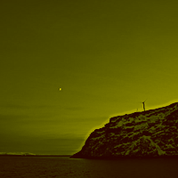

# Resize image to given dimensions


> Image credits [@nickxjones | Unsplash](https://unsplash.com/@nickxjones_)

```sh
curl --location --request POST 'https://xxxxxxxxxx.execute-api.ap-southeast-2.amazonaws.com' \
--header 'Content-Type: application/json' \
--data-raw '{
   "source":{
      "http":{
         "url":"https://images.unsplash.com/photo-1444021465936-c6ca81d39b84?w=300&q=80"
      }
   },
   "commands":[
      {
         "name":"resize",
         "options":{
            "width":150,
         }
      }
   ]
}
'
```

Result


# Tint, resize, flip horizontally, sharpen, convert to `webp` and upload to S3


> Image credits [@marsmatin | Unsplash](https://unsplash.com/@marsmatin)

```sh
curl --location --request POST 'https://xxxxxxxxxx.execute-api.ap-southeast-2.amazonaws.com' \
--header 'Content-Type: application/json' \
--data-raw '{
  "source": {
    "http": {
      "url": "https://images.unsplash.com/photo-1568429838920-de3a3aa8cf1c?w=600&q=80"
    }
  },
  "destination": {
    "http": true,
    "s3": {
      "bucket": "sls-image-transformation2-dev-images",
      "key": "myFile.webp"
    }
  },
  "options": {
    "outputFormat": "webp"
  },
  "commands": [
    {
      "name": "tint",
      "options": { "r": 255, "g": 240, "b": 16 }
    },
    {
      "name": "resize",
      "options": {
        "height": 200
      }
    },
    {
      "name": "flop"
    },
    {
      "name": "sharpen",
      "options": 2.5
    }
  ]
}
'
```

Result


